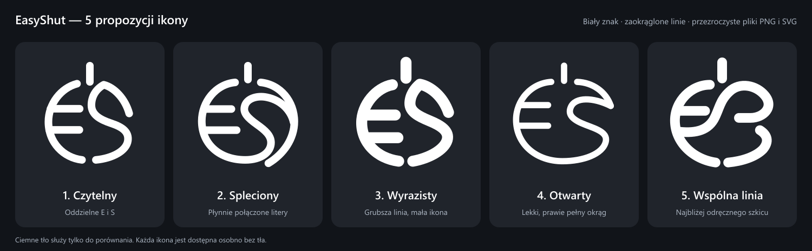

# Propozycje ikony EasyShut

Pięć wariantów do wyboru. Każdy przedstawia białe, zaokrąglone E i S tworzące okrągły znak z osobną kreską zasilania na górze.

| Numer | Wariant | Pliki z przezroczystym tłem |
| --- | --- | --- |
| 1 | Czytelny | [PNG](01-czytelny.png) · [SVG](01-czytelny.svg) |
| 2 | Spleciony | [PNG](02-spleciony.png) · [SVG](02-spleciony.svg) |
| 3 | Wyrazisty | [PNG](03-wyrazisty.png) · [SVG](03-wyrazisty.svg) |
| 4 | Otwarty | [PNG](04-otwarty.png) · [SVG](04-otwarty.svg) |
| 5 | Wspólna linia | [PNG](05-wspolna-linia.png) · [SVG](05-wspolna-linia.svg) |

PNG: 1024 × 1024 px, RGBA, biały znak i przezroczyste tło. SVG można skalować bez utraty jakości. Ciemne tło jest wyłącznie w planszy porównawczej i galerii `index.html`.

Pierwsze propozycje powstały przy użyciu wbudowanego narzędzia generowania obrazów na podstawie szkicu użytkownika. Generator nie zachował poprawnej przezroczystości. Finalne pliki są osobno skonstruowaną grafiką wektorową, odwzorowującą kierunki tych pięciu propozycji. PNG jest renderowane bezpośrednio z SVG; wygenerowane bitmapy nie są źródłem eksportu. Zestaw promptów zachowano w `prompts.json`.

Źródłem konstrukcji jest `generate.mjs`. Odtworzenie plików wymaga Node.js i pakietu `sharp`: `node generate.mjs`. Ten skrypt nie jest częścią budowania aplikacji ani jej zależności.

Żaden wariant nie został jeszcze ustawiony jako ikona programu — zestaw służy do wyboru projektu.
