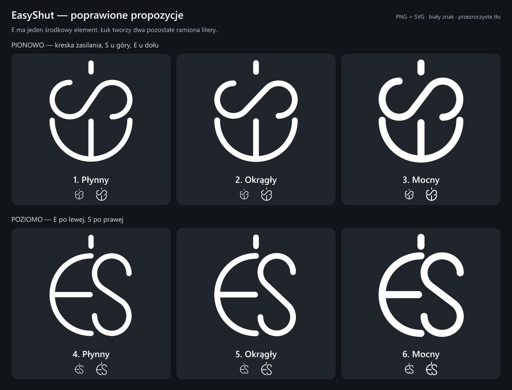

# EasyShut — poprawione propozycje ikony

Układ pionowy odpowiada szkicowi: u góry osobna pionowa kreska zasilania, pod nią obrócone S, na dole obrócone E. Wersja pozioma obraca obie litery o 90° zgodnie z ruchem wskazówek zegara; kreska zasilania pozostaje pionowa nad środkiem.

E składa się z dokładnego półokręgu i **jednej** środkowej kreski. Końce łuku tworzą dwa zewnętrzne ramiona E. S jest zbudowane z dwóch równych łuków eliptycznych (w modelu Okrągły — z łuków okręgów), połączonych wspólną styczną. Dzięki temu przejścia nie mają załamań. Wszystkie końcówki są zaokrąglone.

| Numer | Układ i model | Pliki |
| --- | --- | --- |
| 1 | Pionowy · Płynny | [PNG](1-pionowy-plynny.png) · [SVG](1-pionowy-plynny.svg) |
| 2 | Pionowy · Okrągły | [PNG](2-pionowy-okragly.png) · [SVG](2-pionowy-okragly.svg) |
| 3 | Pionowy · Mocny | [PNG](3-pionowy-mocny.png) · [SVG](3-pionowy-mocny.svg) |
| 4 | Poziomy · Płynny | [PNG](4-poziomy-plynny.png) · [SVG](4-poziomy-plynny.svg) |
| 5 | Poziomy · Okrągły | [PNG](5-poziomy-okragly.png) · [SVG](5-poziomy-okragly.svg) |
| 6 | Poziomy · Mocny | [PNG](6-poziomy-mocny.png) · [SVG](6-poziomy-mocny.svg) |

[Pobierz cały zestaw](EasyShut-ikony-v2.zip).

Pliki ikon: czysta biel, przezroczyste tło; PNG 1024 × 1024 px i skalowalne SVG. Ciemne tło występuje wyłącznie na planszach porównawczych i w podglądzie `index.html`. Małe znaki pod każdą propozycją pokazują jej wygląd przy 28 i 36 px.

Pliki źródłowe SVG są budowane w `generate.mjs`, bez generowania lub edycji bitmap. Eksport PNG wymaga Node.js i biblioteki `sharp`. Żaden wariant nie został jeszcze włączony do aplikacji — zestaw służy do wyboru.
