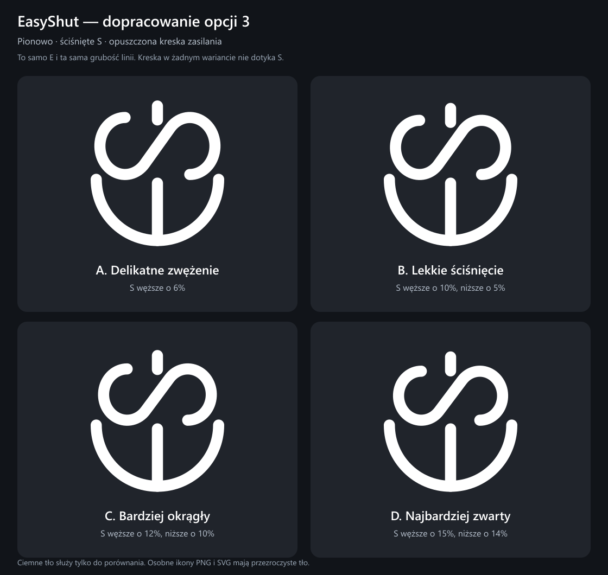
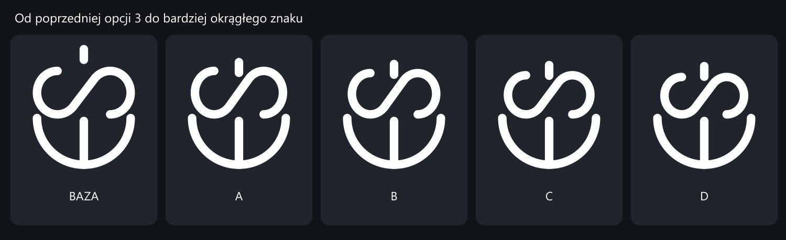

# EasyShut — dopracowanie pionowej opcji 3

Punktem wyjścia jest opcja 3 (Pionowy · Mocny) z poprzedniej rundy. E, jego pojedyncza środkowa kreska, grubość wszystkich linii i długość kreski zasilania pozostają takie same. Zmieniają się wyłącznie proporcje S oraz pionowe położenie kreski zasilania.

| Wariant | Zmiana S | Pliki |
| --- | --- | --- |
| A — Delikatne zwężenie | S węższe o 6% | [PNG](A-delikatny.png) · [SVG](A-delikatny.svg) |
| B — Lekkie ściśnięcie | S węższe o 10%, niższe o 5% | [PNG](B-umiarkowany.png) · [SVG](B-umiarkowany.svg) |
| C — Bardziej okrągły | S węższe o 12%, niższe o 10% | [PNG](C-okragly.png) · [SVG](C-okragly.svg) |
| D — Najbardziej zwarty | S węższe o 15%, niższe o 14% | [PNG](D-zwarty.png) · [SVG](D-zwarty.svg) |

Procenty odnoszą się do geometrii środkowej linii S. Grubość linii pozostaje stała. Zwężenie jest symetryczne względem środka ikony; zmiana wysokości zachowuje dolny poziom S, aby utrzymać jego położenie względem E.

Wszystkie kreski zasilania są opuszczone. W żadnym wariancie kreska nie styka się z S: najkrótsza odległość między widocznymi krawędziami wynosi ponad 10 jednostek w układzie 512 × 512 (ponad 20 px w eksporcie 1024 × 1024). Obliczenia uwzględniają grubość linii i zaokrąglone końce. Wyniki zapisano w `geometry-checks.json`.

[Pobierz zestaw PNG i SVG](EasyShut-ikony-v3.zip). Podgląd z odnośnikami do poszczególnych plików: `index.html`.

Ikony PNG 1024 × 1024 i SVG są czysto białe na przezroczystym tle. Plansze porównawcze mają ciemne tło wyłącznie dla czytelności. Źródło wektorowe i sprawdzanie odstępów znajdują się w `generate.mjs` (Node.js i `sharp`). Żaden wariant nie został jeszcze włączony do aplikacji.
