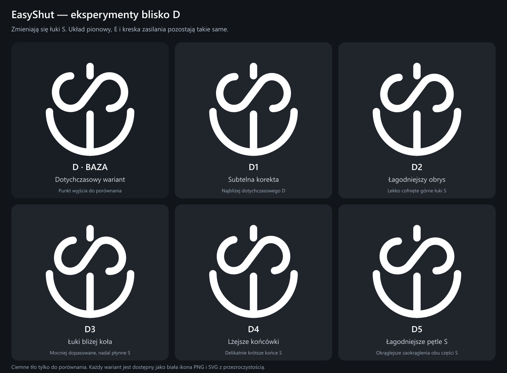

# EasyShut — eksperymenty blisko D

Punktem wyjścia jest pionowy wariant D z trzeciej rundy. Wszystkie propozycje zachowują E, jego jedną środkową kreskę, grubość linii i położenie kreski zasilania. Zmiany dotyczą tylko kształtu S.

| Wariant | Charakter zmiany | Pliki |
| --- | --- | --- |
| D — baza | Dotychczasowy wariant, do porównania | [PNG](D-baza.png) · [SVG](D-baza.svg) |
| D1 | Subtelna korekta, najbliższa bazie | [PNG](D1-subtelny.png) · [SVG](D1-subtelny.svg) |
| D2 | Górne łuki lekko cofnięte w stronę środka koła | [PNG](D2-lagodny-obrys.png) · [SVG](D2-lagodny-obrys.svg) |
| D3 | Mocniejsze dopasowanie łuków do okrągłego obrysu | [PNG](D3-luki-kola.png) · [SVG](D3-luki-kola.svg) |
| D4 | Dopasowane łuki i nieco krótsze końcówki S | [PNG](D4-otwarte-koncowki.png) · [SVG](D4-otwarte-koncowki.svg) |
| D5 | Okrąglejsze proporcje obu pętli S | [PNG](D5-lagodniejsze-petle.png) · [SVG](D5-lagodniejsze-petle.svg) |

[Pobierz cały zestaw PNG i SVG](EasyShut-ikony-v4.zip).

Podgląd `index.html` ma przełącznik **Pokaż obrys koła do porównania**. Pomocnicze koło jest wyznaczone przez łuk E. Nie jest częścią plików ikon.

Kształt S jest zbudowany z dwóch gładkich, lekko obróconych elips oraz ich wspólnej stycznej. Zmiana promieni i położenia łuków ogranicza wystające fragmenty, zachowując płynne przejścia do środka S. Końcówki pozostają zaokrąglone. Obrys nie jest wymuszany kosztem rozpoznawalności litery.

Sprawdzono odstępy uwzględniające grubość linii i zaokrąglone końcówki. Kreska zasilania nie dotyka S, a S nie styka się z E. Najmniejsza przerwa między kreską a S wynosi około 8,78 jednostki w układzie 512 × 512, czyli ponad 17 px przy eksporcie 1024 × 1024. Wyniki dla każdego wariantu są w `geometry-checks.json`.

Ikony PNG 1024 × 1024 oraz SVG są białe i mają przezroczyste tło. Ciemne tło występuje wyłącznie w planszy porównawczej i galerii. Źródło konstrukcji: `generate.mjs` (Node.js i `sharp`). Zestaw nie zmienia jeszcze ikony zainstalowanej aplikacji.
