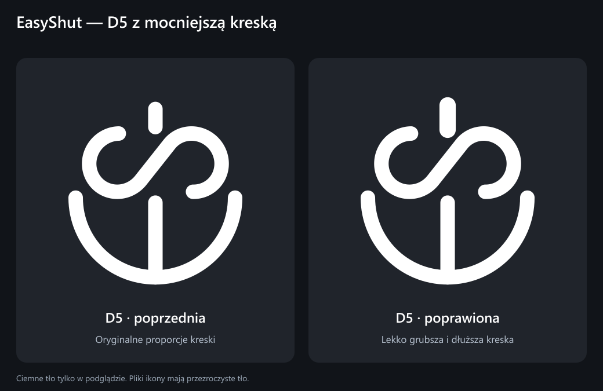

# EasyShut — D5 z grubszą i dłuższą kreską

Poprawka wariantu D5: kreska zasilania jest o 12,5% grubsza, a jej całkowita widoczna długość wzrosła o 25%. Zachowuje zaokrąglone końce i odstęp od S. Litery E i S są identyczne jak w D5 z poprzedniej rundy.

[PNG 1024 × 1024](D5-grubsza-dluzsza-kreska.png) · [SVG](D5-grubsza-dluzsza-kreska.svg)

Ikona jest biała, z przezroczystym tłem. Ciemne tło występuje wyłącznie w porównaniu. Ten wariant został wybrany jako ikona programu od wersji 1.2.1; [zasoby aplikacji](../../README.md).

Źródło: `generate.mjs` (Node.js i `sharp`). Skrypt modyfikuje wyłącznie kreskę istniejącego wektora D5, sprawdza odstęp od S oraz biel i przezroczystość PNG. Wyniki są zapisane w `geometry-checks.json`.
